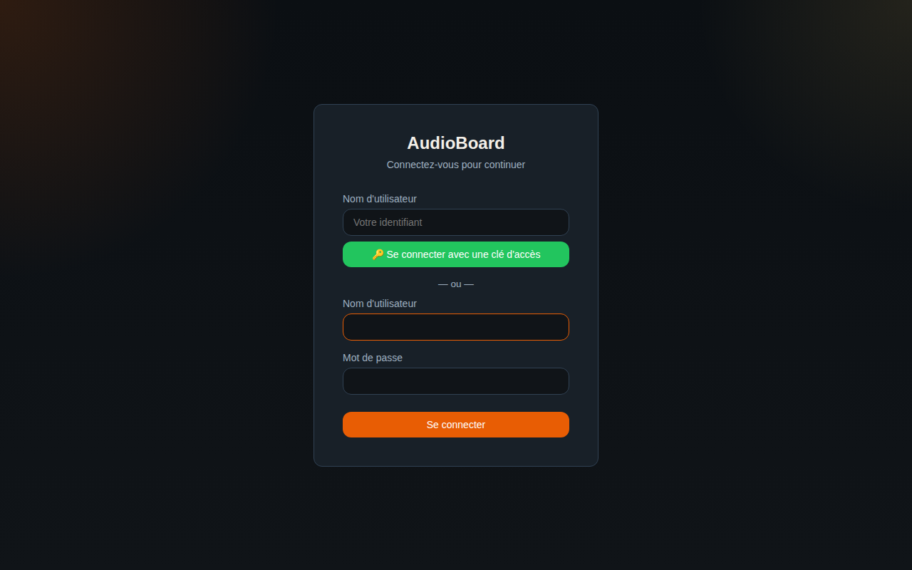
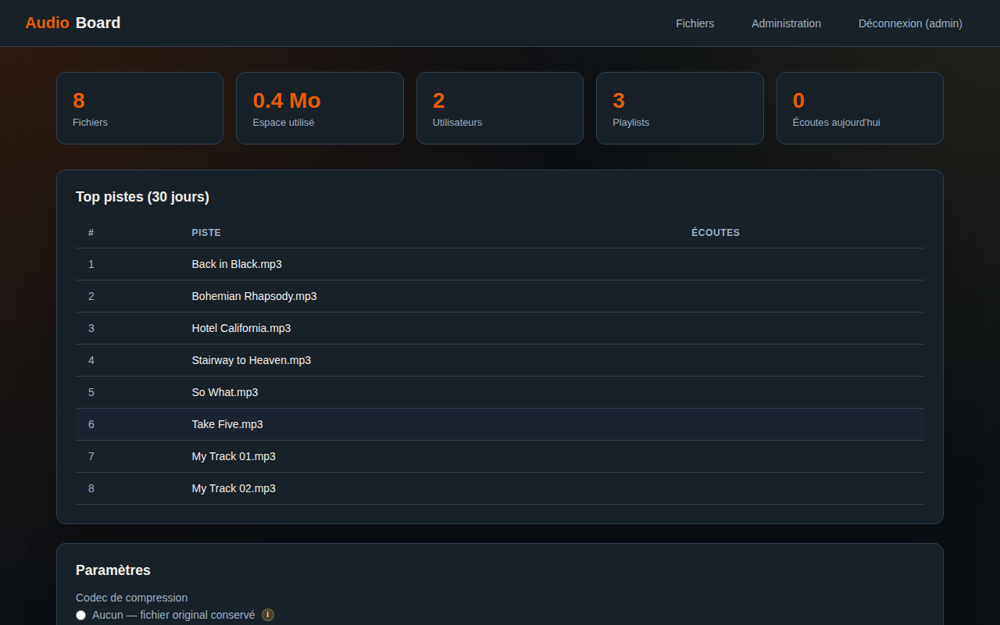
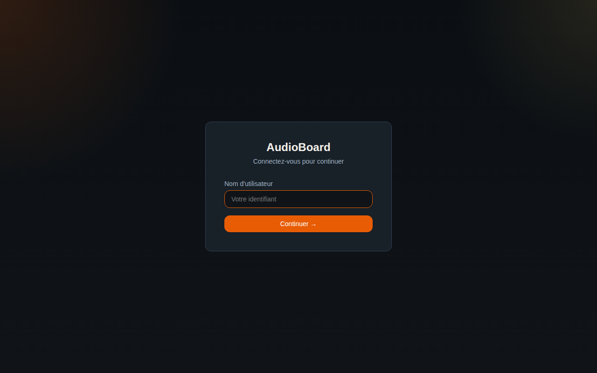
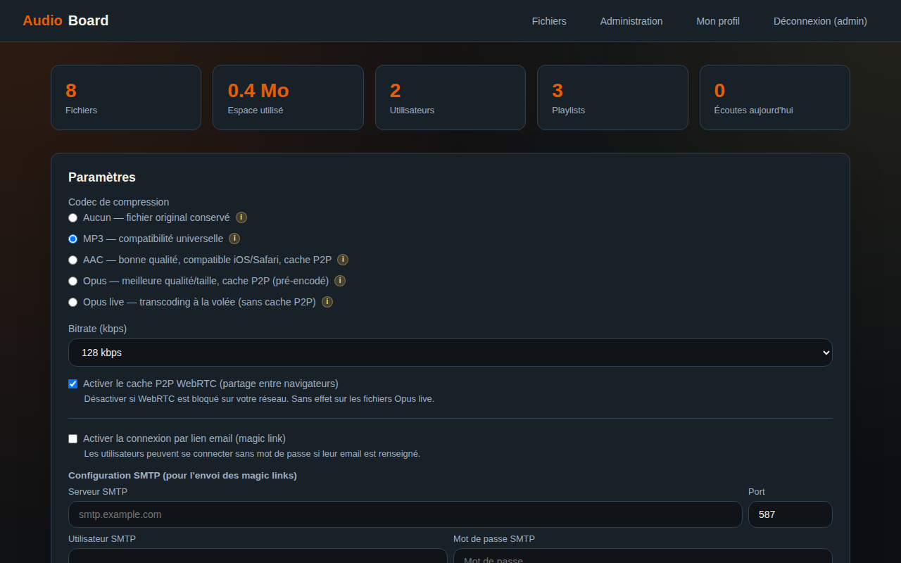

# Guide Administrateur — AudioBoard

AudioBoard est une plateforme d'hébergement et de partage de fichiers audio autonome.
Ce guide couvre l'ensemble des fonctionnalités d'administration.

## Table des matières

1. [Accès initial](#accès-initial)
2. [Gestion des utilisateurs](#gestion-des-utilisateurs)
3. [Connexion sans mot de passe (Magic Link)](#connexion-sans-mot-de-passe-magic-link)
4. [Configuration SMTP](#configuration-smtp)
5. [Codec audio](#codec-audio)
6. [Cache P2P WebRTC](#cache-p2p-webrtc)
7. [Durée de rétention](#durée-de-rétention)
8. [Gestion des playlists](#gestion-des-playlists)

---

## Accès initial

Au premier démarrage, un compte administrateur est créé automatiquement :

| Champ | Valeur |
|-------|--------|
| Identifiant | `admin` |
| Mot de passe | `admin` |

> **Changez ce mot de passe immédiatement** en production en supprimant le compte
> et en recréant un administrateur avec un mot de passe fort.



---

## Gestion des utilisateurs

La console d'administration (`/admin`) centralise la gestion des comptes.



### Créer un utilisateur

Remplissez le formulaire en haut de la section **Utilisateurs** :

| Champ | Obligatoire | Description |
|-------|:-----------:|-------------|
| Nom d'utilisateur | ✓ | Identifiant unique de connexion |
| Mot de passe | ✓ | Mot de passe initial |
| Email | — | Adresse email — requis pour le magic link |
| Rôle | ✓ | `Uploader` : accès à ses playlists · `Admin` : accès complet |

### Modifier l'email d'un utilisateur

Dans la colonne **Email** du tableau, saisissez ou modifiez l'adresse et cliquez **OK**.
L'email est obligatoire pour qu'un utilisateur puisse utiliser la connexion par lien.

### Supprimer un utilisateur

Cliquez **Suppr.** en regard du compte concerné et confirmez.
Cette action supprime en cascade toutes ses playlists et ses fichiers audio.

> Les administrateurs ne peuvent pas supprimer leur propre compte.

---

## Connexion sans mot de passe (Magic Link)

Le magic link permet aux utilisateurs de se connecter sans saisir de mot de passe.
Un lien à usage unique est envoyé par email et expire après **15 minutes**.



### Activer le magic link

1. Dans **Paramètres**, cochez **Activer la connexion par lien email (magic link)**
2. Configurez le serveur SMTP (section suivante)
3. Assurez-vous que chaque utilisateur concerné a un email renseigné
4. Cliquez **Sauvegarder**

Lorsque le mode est actif, la page de connexion propose :
- Un formulaire d'envoi de lien (par défaut)
- Un bouton **Se connecter avec un mot de passe** pour basculer vers le formulaire classique

> **Sécurité** : si un utilisateur n'a pas d'email renseigné, la demande de lien affiche
> un message neutre sans révéler si le compte existe (protection contre l'énumération).

---

## Configuration SMTP

Nécessaire pour l'envoi des magic links.



| Champ | Description | Exemple |
|-------|-------------|---------|
| **Serveur SMTP** | Adresse du serveur de messagerie | `smtp.gmail.com` |
| **Port** | 587 = STARTTLS · 465 = SSL/TLS implicite | `587` |
| **TLS (port 465)** | Cocher si le port 465 est utilisé | — |
| **Utilisateur SMTP** | Identifiant de connexion au serveur | `user@gmail.com` |
| **Mot de passe SMTP** | Mot de passe ou App Password | — |
| **Adresse expéditeur** | Adresse affichée comme expéditeur | `audioboard@mondomaine.fr` |

### Exemples de configuration

**Gmail avec App Password**
```
Serveur  : smtp.gmail.com
Port     : 587
TLS      : non coché (STARTTLS)
Login    : votre.adresse@gmail.com
Password : [App Password 16 caractères — Compte Google → Sécurité → Mots de passe d'application]
```

**OVH / Infomaniak**
```
Serveur  : ssl0.ovh.net
Port     : 587
Login    : votre.adresse@domaine.fr
Password : [mot de passe du compte mail]
```

**Serveur local (Mailhog pour les tests)**
```
Serveur  : localhost
Port     : 1025
Login    : (vide)
Password : (vide)
```

---

## Codec audio

Définit comment les fichiers uploadés sont traités et stockés.

| Codec | Stockage | Cache P2P | Recommandé pour |
|-------|----------|:---------:|-----------------|
| **Aucun** | Fichier original | ✓ | Archives, qualité maximale |
| **MP3** | Pré-encodé | ✓ | Compatibilité universelle |
| **AAC** | Pré-encodé | ✓ | iOS / Safari natif, mobile-first |
| **Opus** | Pré-encodé | ✓ | Navigateurs modernes, meilleur ratio qualité/taille |
| **Opus live** | Fichier original + transcodage à la volée | ✗ | Économie d'espace disque, usage ponctuel |

> **Opus live** : le transcodage est effectué en temps réel à chaque écoute.
> Plus gourmand en CPU. Incompatible avec le cache P2P.
> Pour de nombreux utilisateurs simultanés, préférez un codec pré-encodé.

### Bitrate

| Codec | Plage disponible | Valeur conseillée |
|-------|-----------------|-------------------|
| MP3 | 64 – 320 kbps | 128 kbps |
| AAC | 64 – 256 kbps | 128 kbps |
| Opus / Opus live | 32 – 192 kbps | 96 kbps |

Le choix du codec et du bitrate s'applique aux **nouveaux uploads** uniquement.
Les fichiers déjà en base conservent leur codec d'origine.

---

## Cache P2P WebRTC

Le cache P2P permet aux navigateurs de s'échanger directement les fichiers audio,
réduisant la charge du serveur après le premier téléchargement.

**Fonctionnement :**

1. **Premier auditeur** → téléchargement depuis le serveur → mis en cache dans IndexedDB
2. **Auditeurs suivants** → récupération des chunks depuis les pairs actifs (LAN ou WAN)
3. **Prochaine écoute du même utilisateur** → lecture depuis le cache local (zéro requête serveur)

**Désactiver WebRTC si :**
- WebRTC est bloqué par votre réseau d'entreprise ou pare-feu
- Vous utilisez uniquement le codec Opus live
- Vous souhaitez un contrôle total de tous les flux réseau

La case **Activer le cache P2P WebRTC** dans les paramètres prend effet immédiatement
pour les nouveaux chargements de page.

---

## Durée de rétention

Définit combien de jours les fichiers sont conservés avant suppression automatique.

- Valeur par défaut : **30 jours**
- Plage : 1 à 3 650 jours
- Le nettoyage s'exécute automatiquement **toutes les heures**
- Les tokens de magic link expirés sont également nettoyés automatiquement

> Pour une conservation permanente, utilisez une valeur élevée (ex. `3650` ≈ 10 ans).

---

## Gestion des playlists

La section **Toutes les playlists** liste l'ensemble des playlists de tous les utilisateurs.

| Colonne | Description |
|---------|-------------|
| Playlist | Nom de la playlist |
| Propriétaire | Utilisateur créateur |
| Fichiers | Nombre de pistes audio |
| Créée le | Date de création |
| Lien public | État du partage public |

### Lien public

| Action | Effet |
|--------|-------|
| **Générer** | Crée un lien public permanent (accès sans authentification) |
| **Copier** | Copie l'URL dans le presse-papiers |
| **Révoquer** | Désactive immédiatement le lien — les personnes qui l'ont peuvent encore l'utiliser jusqu'à la révocation |

### Supprimer une playlist

Cliquez **Suppr.** et confirmez.
Supprime la playlist, tous ses fichiers audio et libère l'espace disque correspondant.
