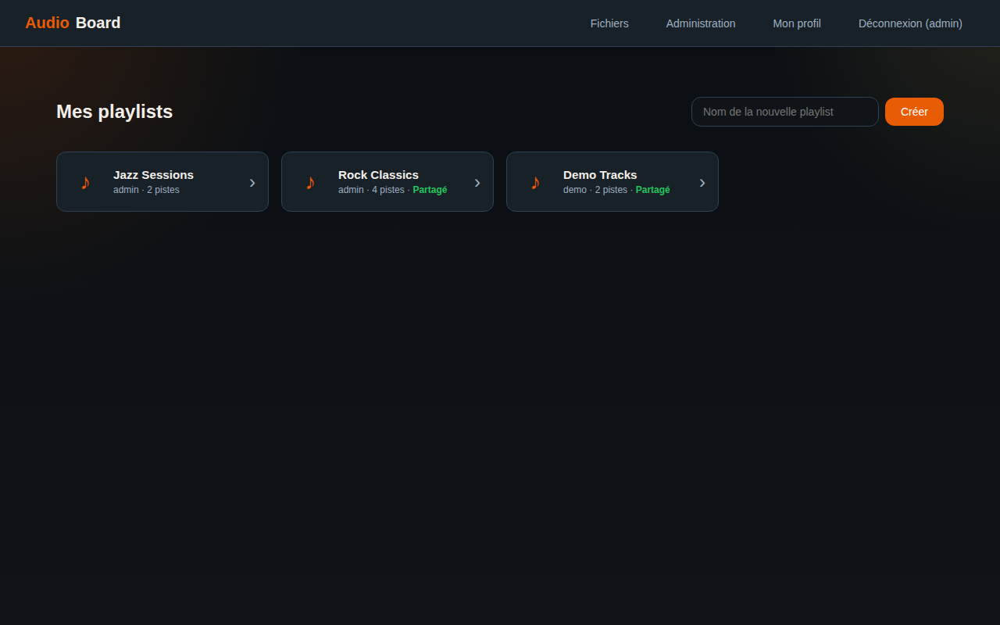
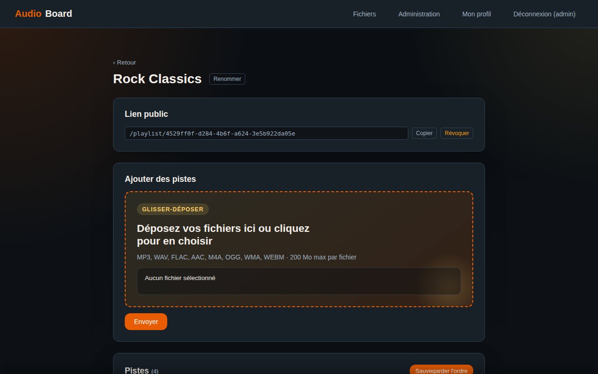
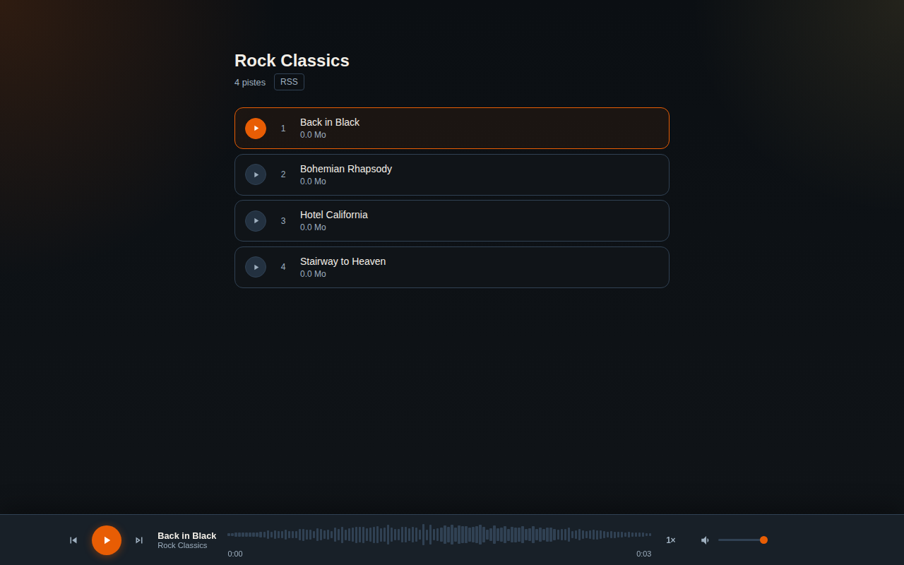
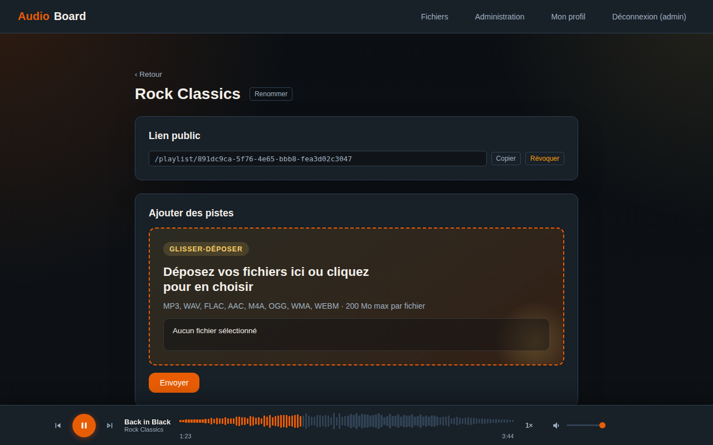
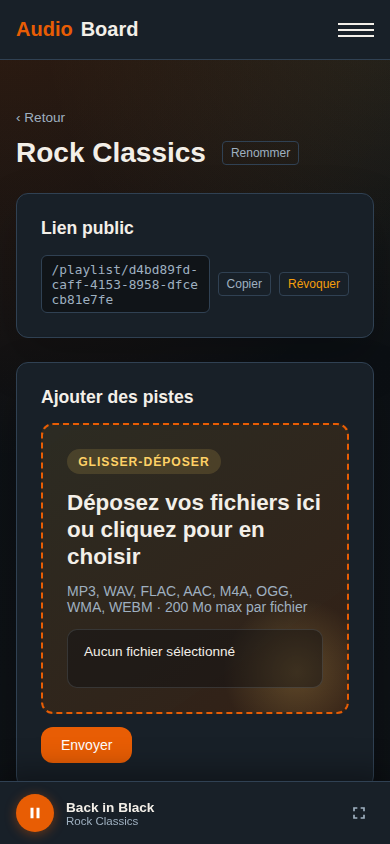
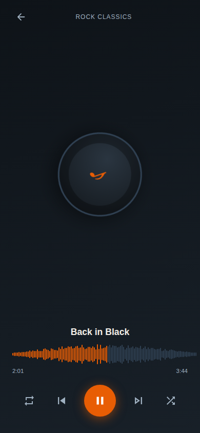

# Guide Utilisateur — AudioBoard

AudioBoard vous permet de gérer, organiser et partager vos fichiers audio depuis
votre navigateur, sans installation.

## Table des matières

1. [Se connecter](#se-connecter)
2. [Tableau de bord](#tableau-de-bord)
3. [Créer une playlist](#créer-une-playlist)
4. [Uploader des fichiers](#uploader-des-fichiers)
5. [Gérer les pistes](#gérer-les-pistes)
6. [Partager une playlist](#partager-une-playlist)
7. [Lecteur audio — Bureau](#lecteur-audio--bureau)
8. [Lecteur audio — Mobile](#lecteur-audio--mobile)

---

## Se connecter

### Connexion classique

Saisissez votre nom d'utilisateur et votre mot de passe, puis cliquez **Se connecter**.

### Connexion par lien email (magic link)

Si l'administrateur a activé cette option :

1. Saisissez votre nom d'utilisateur
2. Cliquez **Recevoir un lien de connexion**
3. Consultez votre boîte mail et cliquez sur le lien reçu

> Le lien expire après **15 minutes** et ne peut être utilisé qu'**une seule fois**.
> Vous pouvez toujours utiliser votre mot de passe en cliquant
> **Se connecter avec un mot de passe**.

---

## Tableau de bord

Le tableau de bord affiche toutes vos playlists sous forme de cartes.

Chaque carte indique :
- Le nom de la playlist
- Le nombre de pistes
- Un badge **Partagé** si un lien public est actif

Cliquez sur une carte pour ouvrir l'éditeur de la playlist.

---

## Créer une playlist

1. Saisissez un nom dans le champ **Nouvelle playlist**
2. Cliquez **Créer**

La playlist s'ouvre immédiatement dans l'éditeur.

---

## Uploader des fichiers

### Formats supportés

| Format | Extension |
|--------|-----------|
| MP3 | `.mp3` |
| WAV | `.wav` |
| FLAC | `.flac` |
| OGG Vorbis | `.ogg` |
| AAC / M4A | `.aac` `.m4a` |
| WMA | `.wma` |
| WebM Audio | `.webm` |

Taille maximale par fichier : **200 Mo**.

### Par glisser-déposer

Faites glisser un ou plusieurs fichiers directement dans la zone de dépôt.

### Par sélection

Cliquez dans la zone de dépôt pour ouvrir le sélecteur de fichiers.
La sélection multiple est prise en charge.

### Progression

Une barre de progression s'affiche pour chaque fichier.
Selon le codec configuré par l'administrateur, un encodage peut avoir lieu
après l'upload — la piste apparaît dans la liste une fois le traitement terminé.

---

## Gérer les pistes

### Lire une piste

Cliquez sur la ligne de la piste ou sur le bouton **▶** à gauche de son nom.
Le lecteur s'ouvre en bas de l'écran.

### Réordonner les pistes

Faites glisser la poignée **⠿** (à gauche de chaque piste) pour changer l'ordre.
La nouvelle position est sauvegardée automatiquement.

### Copier le lien d'une piste

Cliquez sur l'icône **🔗** à droite de la piste.
Le lien de partage direct est copié dans le presse-papiers.

### Supprimer une piste

Cliquez sur l'icône **🗑** à droite de la piste et confirmez.
Le fichier est supprimé définitivement du serveur.

### Renommer la playlist

Cliquez **Renommer** en haut de la page, saisissez le nouveau nom et confirmez.

---

## Partager une playlist

### Générer un lien public

1. Cliquez **Générer un lien de partage**
2. Le lien apparaît dans la zone grisée
3. Cliquez **Copier** pour le copier dans le presse-papiers

Le lien public permet à n'importe qui d'écouter la playlist **sans compte** AudioBoard.
La page publique affiche toutes les pistes et un lecteur intégré.

### Révoquer le lien

Cliquez **Révoquer**. Le lien devient immédiatement invalide.
Vous pouvez en générer un nouveau à tout moment.

---

## Lecteur audio — Bureau

Le lecteur est ancré en bas de l'écran. Il persiste lors de la navigation entre les pages.

### Contrôles

| Bouton | Action |
|--------|--------|
| **⏮** | Piste précédente |
| **▶ / ⏸** | Lecture / Pause |
| **⏭** | Piste suivante |
| **🔁** | Activer / désactiver la boucle |
| **🔀** | Activer / désactiver la lecture aléatoire |

### Barre de progression (forme d'onde)

Cliquez n'importe où sur la forme d'onde pour vous déplacer dans le morceau.

### Volume

Faites glisser le curseur de volume à droite du lecteur.

### Persistance de la lecture

Si vous rechargez la page ou naviguez vers une autre section, le lecteur reprend
automatiquement à l'endroit où vous étiez.

---

## Lecteur audio — Mobile

Sur mobile, le lecteur s'affiche sous forme de **barre compacte** en bas de l'écran.

La barre compacte affiche :
- Une barre de progression tactile
- Le bouton lecture / pause
- Le titre de la piste en cours

### Passer en plein écran

Appuyez sur la flèche **↑** pour ouvrir le lecteur en plein écran.

Le mode plein écran affiche :
- Une pochette animée (rotation pendant la lecture)
- La forme d'onde complète avec seek tactile
- Tous les contrôles : boucle, précédent, lecture/pause, suivant, aléatoire

Pour fermer le plein écran, appuyez sur la flèche **↓** ou balayez vers le bas.

---

## Bon à savoir

### Cache P2P

Si activé par l'administrateur, les fichiers déjà écoutés sont mis en cache dans
votre navigateur (IndexedDB). Lors d'une prochaine écoute du même fichier,
le chargement est instantané sans solliciter le serveur.

Le cache fonctionne automatiquement en arrière-plan — aucune action requise.

### Expiration des fichiers

Les fichiers ont une durée de vie configurée par l'administrateur (par défaut 30 jours).
Passé ce délai, ils sont automatiquement supprimés.
